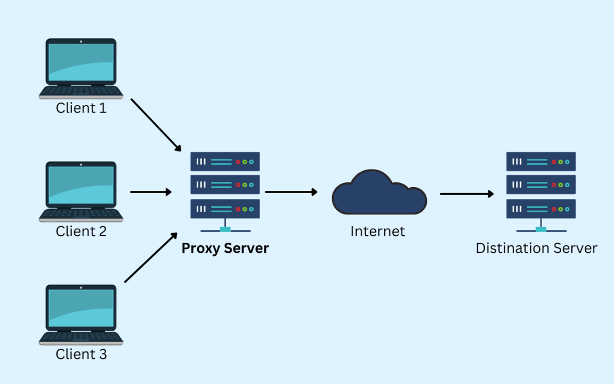
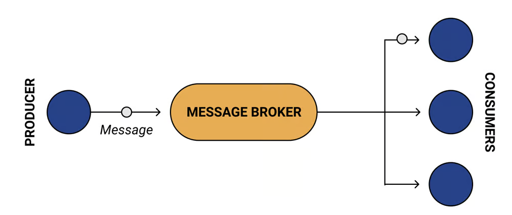
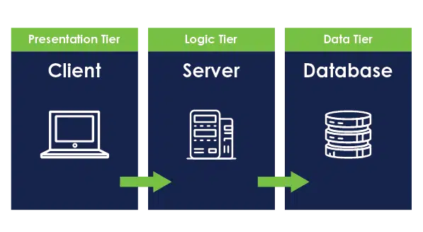

+++

title = "[DS] Preliminaries"
description = "Preliminaries about Distributed Systems Engineering"
outputs = ["Reveal"]
aliases = [
    "/preliminaries/"
]

+++

# Preliminaries about Distributed Systems Engineering

{}

---

{}

# What is a Distributed System?

---

### Leslie Lamport (1987)

> A distributed system is one in which the failure of a computer you didn’t even know existed can render your own computer unusable

### __Interpretation__

This humorous yet insightful definition highlights one of the main challenges in distributed systems—hidden interdependencies between machines and how a failure in one part of the system can have unforeseen consequences elsewhere.

---

### Andrew S. Tanenbaum (2002)

> A distributed system is a collection of independent computers that appears to its users as a single coherent system

### __Interpretation__

This definition emphasizes the illusion of a unified system despite the fact that it is made up of multiple independent machines.

The key idea is that users should not be aware that the system is distributed.

---

### Coulouris, Dollimore, and Kindberg (2005)

> A distributed system is one in which components located at networked computers communicate and coordinate their actions only by passing messages.

### __Interpretation__

This definition focuses on the communication and coordination aspect of distributed systems, particularly the reliance on message passing across a network to achieve collaboration among independent components.

---

### George Coulouris (2001)

> A distributed system is a system in which hardware or software components located at networked computers communicate and coordinate their actions by passing messages.

### __Interpretation__

This expands the idea of distributed systems to both hardware and software components, emphasizing the key role of communication over a network.

---

### Peter Van Roy (2009)

> A distributed system is a system that consists of a collection of independent computers that appear to the users of the system as a single coherent system.

### __Interpretation__

This builds on Tanenbaum’s definition, stressing the coherence and illusion of a single system, despite its distributed nature across many independent computers.

{}

---

## What is a Distributed System?

### Wrap up

These definitions cover the essential characteristics of distributed systems:
- independent components,
- communication via messages, and the
- challenge of presenting a unified system to the user,
- despite failures or complexities within the system.

---

{}

## Why would you make your system distributed?

- __Scalability__: Handling large-scale systems efficiently
- __Fault Tolerance__ and __Availability__: Ensuring reliability despite failures
- __Low Latency__ and __Geographical Distribution__: Providing better user experience across the globe
- __Resource Sharing__: Efficiently using computing power and storage
- __Handling Big Data__: Processing data locally rather than moving it
- __Parallelism__: Speeding up tasks through concurrent execution
- __Cost Efficiency__: Reducing infrastructure costs through resource pooling
- __Collaboration__: Enabling real-time updates and interactions across distances
- _The functionality to be provided_ by the system simply **implies** _distribution_

---

## Example: Google Search

- __Scalability__: Google handles billions of searches every day
- __Fault Tolerance__ and __Availability__: A single server cannot handle such a massive amount of data
- __Low Latency__ and __Geographical Distribution__: By distributing the search process across thousands of servers worldwide, Google can deliver search results quickly and reliably
- __Parallelism__: Processing multiple search queries concurrently

---

## Example: Social Networks (e.g., Instagram) or Messaging Apps (e.g., WhatsApp)

- __Scalability__: Millions of users are active at the same time
- __Fault Tolerance__ and __Availability__: A single server cannot handle such a massive amount of data
- __Low Latency__ : By distributing the service across multiple servers worldwide, the app can deliver messages quickly and reliably
- __Geographical Distribution__: Users can communicate across the globe
- __Handling Big Data__: Store users' data within that user's region (as per GDPR)
- __Parallelism__: Processing multiple messages concurrently
- __Collaboration__: Enabling real-time updates and interactions across distances
- The functionality is __inherently distributed__

---

## Example: Online Shopping (e.g., Amazon)

- __Scalability__: Millions of users are active at the same time
- __Fault Tolerance__ and __Availability__: A single server cannot handle such a massive amount of data
- __Low Latency__: By distributing the service across multiple servers worldwide, the app can deliver messages quickly and reliably
- __Geographical Distribution__: Comply to local regulations and regional preferences, e.g., language, currency, etc.
- __Parallelism__: Processing multiple orders concurrently
- _The functionality to be provided_ by the system simply **implies** _distribution_

---

## Example: Online Gaming (e.g., LoL, Fortnite)

- __Scalability__: Millions of users are active at the same time
- __Fault Tolerance__ and __Availability__: A single server cannot handle such a massive amount of data
- __Low Latency__: By distributing the service across multiple servers worldwide, the app can deliver messages quickly and reliably
- __Geographical Distribution__: Users can play with others across the globe
- __Parallelism__: Processing multiple games concurrently
- __Collaboration__: Enabling real-time updates and interactions across distances
- _The functionality to be provided_ by the system simply **implies** _distribution_

---

## Example: Google Docs (et. similia)

- __Scalability__: allows for different business models, e.g., subscription-based
- __Fault Tolerance__ and __Availability__: Allows for automatic, implicit updates / file saves / backups
- __Geographical Distribution__: Simplified sharing and collaboration across the globe
- __Parallelism__ and __Collaboration__: Multiple users can edit the same document concurrently

---

## Example: Federated Learning (e.g. [Google's Gboard](https://support.google.com/gboard/answer/12373137?hl=en))

- __Scalability__: Improve learning for all users (while keeping their data private)
- __Geo-Distribution__: Improve the functionality based on the data from different regions
- __Handling Big Data__: Process data locally rather than moving it
- __Parallelism__: Learning occurs on the user's device, anywhere, at any time
- __Cost Efficiency__: A single device would not be sufficient to process all the data
- __Resource Sharing__: Efficiently using computing power and storage, while preserving privacy

{}

---

{}

# How does the SE workflow change for distributed systems?

---

## Recap: Software Engineering Workflow

1. __Use case collection__: _negotiate_ expectations with customer(s) or stakeholders

1. __Requirements analysis__: produce a list of _requirements_ the final product should satisfy
    + with _acceptance criteria_ for each requirement

1. __Design__: produce a _blueprint_ of the software
    + __modelling__: what entities from the _real world_ are represented in the software?
        * how do they _behave_? how do they _interact_?

1. __Implementation__: write the _code_ that reifies the _design_ into software

1. __Verification__: verify that the software _meets_ the _requirements_
    + __automated__ _testing_: write more code to check whether the aforementioned implementation code works
    + __acceptance__ _testing_: test the system with _real_ data and _real_ users

1. __Release__: make one particular _version_ of the software _available_ to the _customers_

1. __Deployment__: install and activate the software for the software

1. __Documentation__: produce _manuals_ and _guides_ for the software

1. __Maintenance__: fix _bugs_, _improve_ the software, _adapt_ it to _new_ requirements

---

## Software Engineering Workflow for _Distributed Systems_

(only additional steps are listed)

1. __Use case collection__:
    - _where_ are the users?
    - _when_ and _how frequently_ do they interact with the system?
    - _how_ do they _interact_ with the system? which _devices_ are they using?
    - does the system need to _store_ user's __data__? _which_? _where_?
    - most likely, there will be _multiple_ __roles__

---

## Software Engineering Workflow for _Distributed Systems_

2. __Requirements analysis__:
    - most likely, answers to the questions above imply __technical constrains__ on the system
        * e.g. where to store data?
            + in case of multiple data centers, how to keep them consistent?
    - will the system need to _scale_? how to handle _faults_? _how_ will it _recover_?
    - _acceptance criteria_ will for all such additional requirements/constraints

---

## Software Engineering Workflow for _Distributed Systems_

3. __Design__:
    - are there _infrastructural components_ that need to be introduced? _how many_?
        * e.g. _clients_, _servers_, _load balancers_, _caches_, _databases_, _message brokers_, _queues_, _workers_, _proxies_, _firewalls_, _CDNs_, _etc._
    - how do components	_distribute_ over the network? _where_?
        * e.g. what are the IP addresses of the servers / brokers / databases / etc.?
    - how do _domain entities_ __map to__ _infrastructural components_?
        * e.g. state of a video game on central server, while inputs/representations on clients
        * e.g. where to store messages in an IM app? for how long?
    - how do components _communicate_? _what_? _which_ __protocols__ do they enact?
    - do components need to store data? _what data_? _where_? _when_? _how many **copies**_?
        * in case of network partition, should the system be _available_ or _consistent_?
    - how do components _find_ each other?
        * how to _name_ components?
        * e.g. _service discovery_, _load balancing_, _etc._
    - _how_ do components _recognize_ each other?
        * e.g. _authentication_, _authorization_, _etc._
    - what should happen when a component _fails_? is it _really_ a failure?
        * e.g. _retries_, _back-off_, _graceful degradation_, _etc._

---

## Software Engineering Workflow for _Distributed Systems_

4. __Implementation__:
    - which _network protocols_ to use?
        * e.g. UDP, TCP, HTTP, WebSockets, gRPC, XMPP, AMQP, MQTT, etc.
    - how should _in-transit data_ be __represented__?
        * e.g. JSON, XML, YAML, Protocol Buffers, etc.
    - how should _persistent data_ be __stored__?
        * e.g. relations, documents, key-value, graph, etc.
    - how should _databases_ be __queried__?
        * e.g. SQL, NoSQL, etc.
    - how should components be _authenticated_?
        * e.g. OAuth, JWT, etc.
    - how should components be _authorized_?
        * e.g. RBAC, ABAC, etc.

---

## Software Engineering Workflow for _Distributed Systems_

5. __Verification__:
    - how to **_unit_-test** distributed components?
    - testing the _integration_ among components is _paramount_
    - how to **_end-to-end_-test** the system?
        * e.g. production vs. test environment
    - _deployment_ __automation__ is commonly used to _test_ the system in _production-like_ environment

---

## Software Engineering Workflow for _Distributed Systems_

6. __Release__:
    - components may (and should) have their __own__ _release cycles_ and _versions_
    - components should be _resilient_ to the __coexistence__ of _multiple_ versions
    - _rolling_ __updates__ are _preferred_ over _big bang_ updates

---

## Software Engineering Workflow for _Distributed Systems_

7. __Deployment__:
    - _where_ to deploy components?
        * e.g. _cloud_, _on-premises_, _hybrid_?
    - _how_ to deploy components?
        * e.g. _containers_, _VMs_, _bare metal_?
    - _how_ to _scale_ components?
        * e.g. _horizontally_, _vertically_, _auto-scaling_?
    - _how_ to _monitor_ components?
        * e.g. _logs_, _metrics_, _traces_?
    - _how_ to _secure_ components?
        * e.g. _firewalls_, _encryption_, _certificates_, _etc._
    - all such aspects should be _automated_
        * tools and companies exist just for this!

---

## Software Engineering Workflow for _Distributed Systems_

8. __Documentation__:
    - protocols and data formats should be _well-documented_
        * allowing for third-parties to create _compatible_ components
    - e.g. _Web API_ specification is public for most Web services

---

9. __Maintenance__:
    - continuous __monitoring__ of _performance_ and _availability_
        * tools and companies exist just for this!
    - _issues tracking_ is non-trivial (may require ad-hoc sub-systems)
    - _sunsetting_ old versions is _crucial_ $\rightarrow$ _coexistence_ of multiple versions
        * __End-of-Life__ should be _scheduled_, not _abrupt_

{}

---

{}

# Nomenclature

---

## Infrastructure

> The infrastructure of a distributed system comprises the communication mechanisms, middleware, and platforms that allow components, located on different networked computers, to communicate and coordinate their actions.
>   — Andrew S. Tanenbaum and Maarten Van Steen - “Distributed Systems: Principles and Paradigms” (2007)

> Infrastructure in a distributed system refers to the underlying hardware, software services, and networks that facilitate the integration, execution, and management of distributed components.
>   — Coulouris, Dollimore, Kindberg - “Distributed Systems: Concepts and Design” (2011)

> In distributed systems, infrastructure is the ensemble of hardware and software that provides the necessary support for computation and communication across a network of independent, interacting components.
>   — Peter Van Roy - “Concepts, Techniques, and Models of Computer Programming” (2004)

---

## Infrastructural Components

> An infrastructural component consists of a software unit — most commonly a process — playing a precise role in the distributed system.
> The role depends on the purpose of the component in the system, and/or how it interacts.

### Examples

clients, servers, brokers, load balancers, caches, databases, queues, masters, workers, proxies, etc.

---

## Synonyms

- __Node__ $\equiv$ an infrastructural component for which the _role_ is __not__ relevant

- __Peer__ $\equiv$ an infrastructural component for which the _role_ is __not__ specified
    * because all components play the same role(s)

---

## Clients and servers

- __Server__ $\equiv$ a component with a _well-known name_/address _responding_ to _requests_ coming from clients
    * it's the components that _listens_ (waits) for remote requests
    * commonly it exposes an _interface_ ($\approx$ the requests it can answer to) to _clients_

- __Client__ $\equiv$ a component that sends _requests_ to servers, waiting for _responses_
    * it's the components that _initiates_ the interaction
    * it may expose an _interface_ to _users_ on how to _interact_ with the server

---

## Proxy

- __Proxy__ $\equiv$ a server acting as a _gateway_ towards another server
    * it _intercepts_ requests from clients and forwards them to the actual server
    * it _intercepts_ responses from the actual server and forwards them to the client
    * it may _cache_ responses to _reduce_ the _load_ on the server

- A _proxy_ performing _caching_ is called a _cache server_ (or just _cache_)

---

## Load Balancer

- __Load Balancer__ $\equiv$ a proxy _distributing_ incoming requests among multiple servers
    * according to some _distribution policy_:
        + _round-robin_,
        + _least connections_,
        + _least response time_,
        + etc.

---

## Broker

- __Broker__ $\equiv$ a server _mediating_ the _communication_ between _producers_ and _consumers_ of data (a.k.a. messages)
    * it _receives_ messages from producers and _forwards_ them to (1 or more) consumers
    * common assumption: consumers _declare_ their interest in receiving messages

- __Producer__ $\equiv$ the component _sending_ messages to _producer(s)_ (via the broker)

- __Consumer__ $\equiv$ the component _receiving_ messages from _consumer(s)_ (via the broker)

- The same component can be simultaneously a _producer_ and a _consumer_

---

## \[Broker with\] Queues

- __Queue__ $\approx$ a data structure where messages are _stored_ in a _FIFO_ manner
    * FIFO storage $\rightarrow$ messages are consumed in the order they were produced
    * storage $\rightarrow$ messages are _not_ lost if consumers are _unavailable_

---

## Message oriented middleware (MOM)

- __MOM__ $\approx$ a sort of broker having multiple channels for messages
    * messages involving the same _topic_ are sent to the same _channel_
    * consumers subscribe to _channels_

- __Topic__ $\equiv$ a _label_ for messages, allowing
    * producers to control which _consumers_ receive the message
    * consumers to _filter_ messages they are interested in
    * the broker to _route_ messages to the correct consumers

- Yes, most MOM technologies use queues to implement channels

---

## Database

- __Database__ $\equiv$ a server specialized in _storing_ and _retrieving_ data
    * in three-tier architectures, the database is the _third_ tier
        + acting as a server for the server (which acts as a client w.r.t the database)

---

## Master—Worker (a.k.a. Master—Slave, or Leader—Follower)

- __Master__ $\equiv$ a server _coordinating_ the _work_ of multiple workers
    * it _distributes_ the work among workers
    * it _collects_ the results from workers

- __Worker__ $\equiv$ a server _executing_ the _work_ assigned by the master

- Common use cases:
    - \[master—worker\] _parallel_ computation
    - \[master—slave\] _replication_ of data

{}